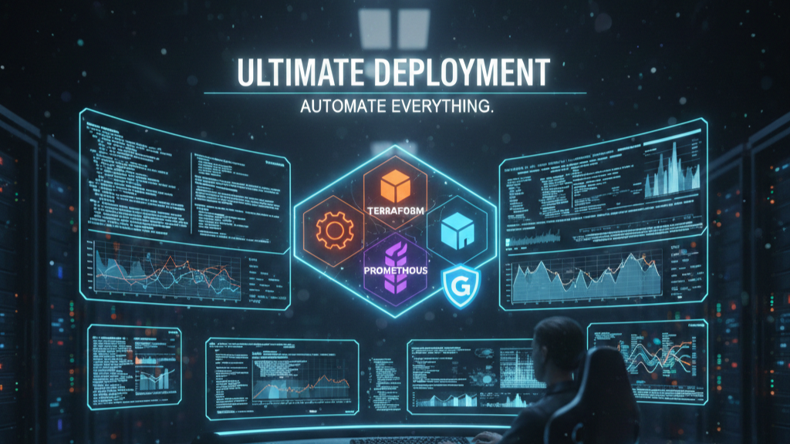

## 🎥 Demo Video

[](https://youtu.be/IrO7A7NN6wM)


# Deployment Infrastructure 🚀

This repository contains infrastructure and automation code for deploying applications using **Terraform** and **Ansible**.  
It is designed to be simple, modular, and maintainable — focusing only on configuration files, not cached binaries or state.

---

## 📂 Project Structure

deployment/
├── main.tf                # Core Terraform configuration
├── ansible/               # Ansible playbooks and scripts
│   ├── inventory.ini       # Server inventory
│   ├── deploy.yaml         # Deployment playbook
│   ├── update.yaml         # Update playbook
│   ├── nginx.sh            # Nginx setup script
│   ├── restart_nginx.sh    # Restart script
│   └── ...                 # Other helper scripts
└── .gitignore              # Ensures .terraform and state files are excluded

Code

---

## ⚙️ Features

- **Terraform** for provisioning infrastructure (AWS, TLS, Local providers).
- **Ansible** for configuration management and deployment automation.
- **Nginx load balancing** setup for production environments.
- Clean Git history — `.terraform/` and state files are ignored.

---

## 🚀 Usage

### 1. Initialize Terraform
```bash
terraform init
2. Plan and Apply
bash
terraform plan
terraform apply
3. Run Ansible Playbooks
bash
ansible-playbook -i ansible/inventory.ini ansible/deploy.yaml
🛡️ Best Practices
Do not commit .terraform/ or terraform.tfstate files — they are environment-specific.

Use a remote backend (e.g., AWS S3 + DynamoDB) for Terraform state.

Keep secrets (like .pem keys) out of GitHub. Use environment variables or secret managers.

📖 Notes
This repo is intended for infrastructure code only.

Large provider binaries are excluded via .gitignore.

Contributions welcome — please open a PR for improvements.

📌 License
This project is licensed under the MIT License.
